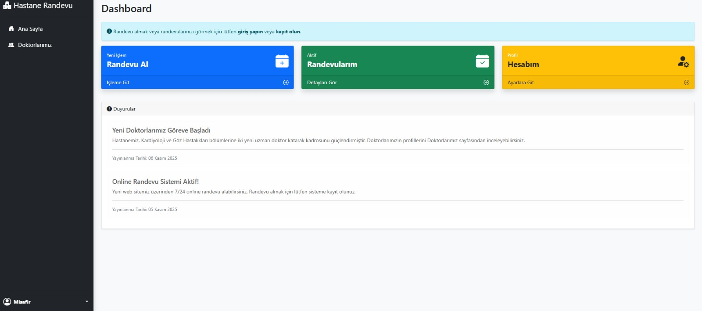
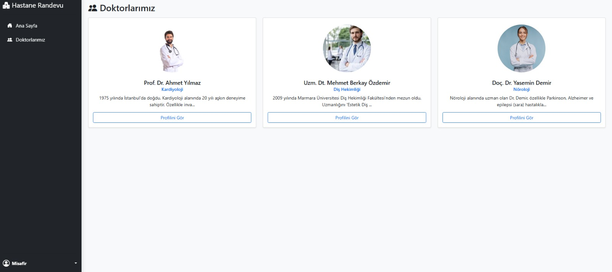
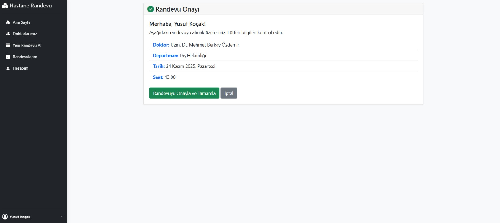
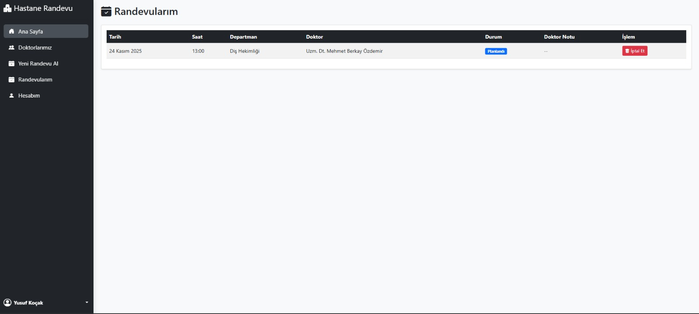
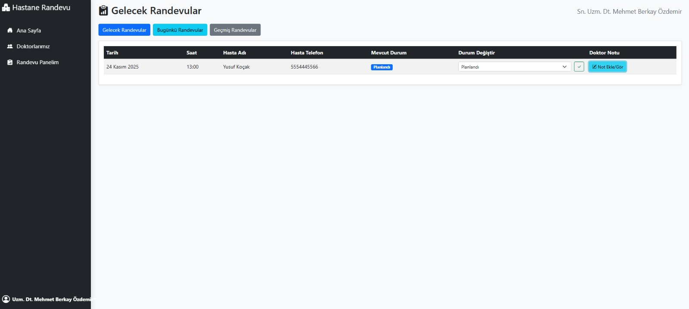

# 🏥 RandevuPlus - Hastane Randevu Otomasyon Sistemi

> **"Beni Türk hekimlerine emanet ediniz." - M. Kemal Atatürk**

Bu proje, hastane süreçlerinin dijitalleşmesi, randevu yönetiminin optimize edilmesi ve doktor-hasta etkileşiminin hızlandırılması amacıyla geliştirilmiş kapsamlı bir **ASP.NET MVC** projesidir. 

⚠️ *Proje ticari potansiyeli ve müşteri gizliliği nedeniyle kaynak kodları (Private Repo) olarak saklanmaktadır. Aşağıda projenin teknik mimarisi ve arayüz görselleri sunulmuştur.*

## 🛠️ Teknik Altyapı (Tech Stack)

Projeyi geliştirirken **Solid Prensipleri** ve **N-Tier Architecture** (Çok Katmanlı Mimari) yapısına sadık kalınmıştır.

* **Backend:** C#, ASP.NET Core MVC
* **Veritabanı:** MSSQL Server 
* **ORM:** Entity Framework Core 
* **Frontend:** HTML5, CSS3
* **Authentication:** ASP.NET Core Identity 

## 💻 Temel Özellikler

Sistem 3 farklı rol üzerinden kurgulanmıştır: **Admin**, **Doktor** ve **Hasta**.

### 1. Yönetim Paneli (Admin Dashboard)
Hastane yöneticisinin kuş bakışı tüm sistemi izlediği alandır.
* 📊 Toplam doktor, hasta ve randevu istatistikleri.
* 🏥 Departman (Poliklinik) ekleme/çıkarma işlemleri.
* 📢 Duyuru yönetimi.

### 2. Doktor Modülü
* 👨‍⚕️ Doktorlar kendilerine atanan randevuları "Gelecek", "Bugünkü" ve "Geçmiş" olarak filtreleyebilir.
* ✅ Randevu durumunu (Tamamlandı, İptal, Gelmedi) güncelleyebilir.

### 3. Hasta Modülü
* 📅 Poliklinik ve doktor seçerek online randevu oluşturma.
* ❌ Aktif randevularını görüntüleme ve iptal edebilme.
* 🔒 Güvenli giriş ve kayıt sistemi.

---

## 📸 Proje Görselleri

### 🔹 Admin Dashboard & İstatistikler
Yöneticilerin sistemi tam kontrolle yönetebildiği, sade ve anlaşılır yönetim paneli.

### 🔹 Ana Sayfa ve Duyurular
Kullanıcı dostu arayüz ile hastane duyurularının ve hızlı işlem menülerinin sunumu.

### 🔹 Doktor Kadrosu
Hastanemizde görev yapan uzmanların listelendiği dinamik kart yapısı.

### 🔹 Randevu Alma Süreci
Hastanın doktor ve saat seçimi sonrası gördüğü özet ve onay ekranı.

### 🔹 Hasta Paneli: Randevularım
Hastanın geçmiş ve gelecek randevularını yönetebildiği, iptal işlemi yapabildiği ekran.

### 🔹 Doktor Paneli: Randevu Yönetimi
Doktorların hastalarını takip ettiği, durumlarını güncellediği profesyonel arayüz.

---
*Developed with ❤️ and ☕ by Mehmet Berkay Özdemir*
